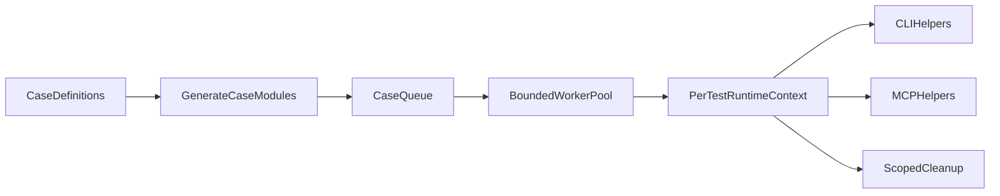

# Full test parallelism and session layout (implementation plan)

This document is the **version-controlled** copy of the test-harness and on-disk layout plan. It stays in `docs/` so clones without Cursor’s local `.cursor/plans/` directory still have the reference.

## Goal

Make **every logical test case** parallel-safe and runnable concurrently with every other logical test case. The end state is:

- no shared `_cli` fallback in tests
- `.giterloper/` contains **only session-id directories**, with no `sessions/` wrapper at all
- no test interface relies on mutable process-global env
- no suite-wide cleanup that touches unrelated sessions or branches
- a bounded worker pool keeps pulling new tests as slots free up, so concurrency is continuous rather than phase-based

## Why the pre-migration suite stops short

The runner historically serialized integration tests (parallel `tests/core/` then serial `tests/cli/` + `tests/mcp/`) and relied on post-run leak cleanup across sessions. Helpers isolated CLI state **per file**, not per logical case. Session paths used `.giterloper/sessions/<sessionId>/`, which the target layout removes. MCP tests used `Deno.env` mutation; Deno 2.x does not run multiple `Deno.test(...)` cases in the same file in parallel, so true per-test parallelism requires a **per-case module** model.

## Recommended architecture

Stay on Deno; change suite shape rather than adopting a second runner.

### 1. Flatten the state layout and introduce a shared test runtime context

Add a helper layer under `tests/helpers/` that creates a **per-test context** with:

- unique `sessionId`, `runId`, temp `cwd`
- per-test `.giterloper/<sessionId>/...` under that `cwd`
- branch/pin/file naming helpers and **injected** server/CLI config
- scoped cleanup for resources that test created

Migrate product code from `.giterloper/sessions/<sessionId>/...` to `.giterloper/<sessionId>/...`.

### 2. Stop using process env as the test interface

Tests pass explicit config into `createServer` / `createMcpAppForTest` / auth / bootstrap paths (`lib/gl-mcp-server.ts`, `lib/mcp-auth.ts`, `lib/gl-core.ts`, `lib/mcp-session-store.ts`). Production entrypoints may still read env once at startup.

### 3. Move integration state off the shared repo root

`runGl` / `runGlMaintenance` default to `ctx.cwd`; assertions use the context, not raw `Deno.cwd()` for session trees.

### 4. Make cleanup strictly test-scoped

Remove suite-wide session sweeps from the default runner path; avoid cleanup that deletes unrelated branches; optional debug-only leak tools only.

## Per-test concurrency in Deno

- Express each logical case as data or `runCase(ctx)` in source modules.
- Generate one runnable module per case.
- Run generated modules through a **bounded worker pool** that backfills until all cases finish.
- Point `scripts/run-tests.ts` and `deno.json` tasks at that unified path.

## Migration order

1. Flatten `.giterloper/<sessionId>/` across lib, tests, and docs.
2. Build `TestRuntimeContext` and convert CLI helpers.
3. Refactor MCP config injection (no `Deno.env.set`/`delete` in tests).
4. Scoped cleanup only.
5. Per-case generator + worker pool; vertical slice from `tests/core`, `tests/cli`, `tests/mcp`.
6. Migrate the rest of the suite.
7. Flip `scripts/run-tests.ts`, `deno.json`, and `tests/README.md` to the final harness.

## Definition of done

- `deno task test` is one bounded worker pool over **logical cases** (no phase barrier such as “all core then all integration”). Cases are scheduled via `scripts/run-tests.ts` and `tests/test-case-manifest.json`.
- `.giterloper/` has only session-id directories (no `sessions/` wrapper).
- Every logical case gets its own session id and isolated cwd/state root automatically (CLI/integration helpers); MCP in-process tests inject auth/bootstrap via `createMcpAppForTest` / server options instead of mutating `Deno.env`.
- Cleanup only affects resources created by the current test; the default harness does not sweep unrelated sessions.
- Optional: `tests/cli/` + `tests/mcp/` subprocesses may be capped separately (`GITERLOPER_REMOTE_TEST_CONCURRENCY`, default 1) for shared-remote stability; this is not an isolation-driven serial split.
- `tests/README.md` and `AGENTS.md` describe the final behavior accurately.
